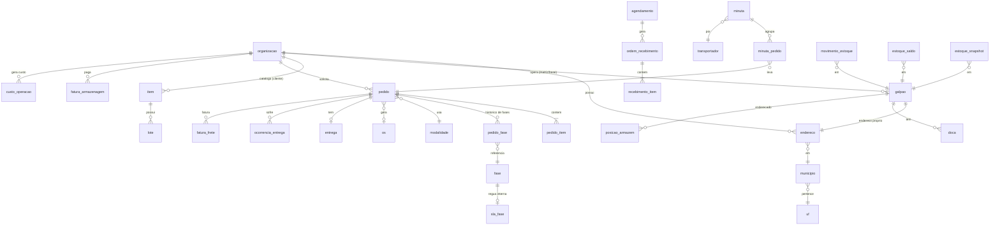

# Modelo de Dados do Staging — referência técnica

<!-- nav:start -->
[Home](../README.md) | [← Entendimento dos Dados](02_entendimento_dados.md) | [Régua de Validação →](04_regua_validacao.md)
<!-- nav:end -->

> Referência técnica do banco `db_fictitur`: o diagrama do modelo e o objetivo de cada uma das 50 tabelas, schema a schema. A fonte da verdade estrutural é o DDL comentado em [`staging/ddl/`](../staging/ddl/); este documento é o mapa de leitura. Para o conceito de negócio por trás de cada domínio, leia antes o [Entendimento dos Dados](02_entendimento_dados.md).

## 1. Diagrama (relacionamentos-chave)

## 2. `cadastro` (20 tabelas)

| tabela | objetivo |
|---|---|
| regiao | as 6 regiões comerciais usadas pela operação |
| uf | as 27 unidades federativas, com região geográfica |
| municipio | cidades do Brasil, com UF e região comercial |
| organizacao | matriz, bases parceiras e clientes numa única tabela (padrão Party), com porte, segmento e OTIF contratual |
| endereco | sedes, destinos de entrega, galpões e pontos de coleta, ancorados em município real |
| galpao | local físico de armazenagem; pertence a uma organização e tem endereço próprio (1:1). Neste caso: matriz com GLP01..GLP04, cada base sendo o seu único galpão |
| doca | docas de recebimento de cada galpão |
| posicao_armazem | endereçamento interno do galpão (prateleira × coluna × altura) com o m³ da posição |
| transportador | transportadores contratados para a entrega |
| parceiro_redespacho | parceiros que completam a perna final em regiões sem cobertura própria |
| usuario | logins de operação (solicitantes, conferentes, cancelamentos) |
| representante | representantes comerciais dos clientes |
| modalidade | modalidades de entrega/serviço (retira, rodoviário, aéreo, exclusivo...) |
| item | catálogo de produtos por cliente, com dimensões físicas, valores e classificações |
| cota | hierarquia de cotas (níveis 1 a 4) por item |
| fase | catálogo das 10 fases do ciclo do pedido (EA a CE), com ordem e flag de esporádica |
| sla_fase | régua interna de duração de cada fase, em horas úteis (meta e limite) |
| sla_manuseio | prazos internos por cliente, com horário de corte e regra própria para retira |
| sla_transporte | prazo de transporte por UF × município × modalidade |
| meta_frete | metas comerciais de R$/kg por região e tipo de destino |

## 3. `fwm` — Fictitur Warehouse Management (17 tabelas)

| tabela | objetivo |
|---|---|
| pedido | a solicitação (SS): cliente, destino, modalidade, origem do pedido, flags e fase atual |
| pedido_item | itens do pedido, com quantidade e valores |
| pedido_fase | histórico longo das fases: entrada e saída de cada fase por pedido (durações derivam daqui) |
| os | ordem de serviço vinculada ao pedido |
| nf | notas fiscais emitidas |
| agendamento | agendamento de chegada de mercadoria: fornecedor, galpão, doca, datas e pesos |
| agendamento_ocorrencia | ocorrências registradas no agendamento |
| ordem_recebimento | a OR que materializa o recebimento agendado |
| recebimento_item | itens recebidos por OR, com SLAs e o galpão de destino |
| lote | lotes por item, com as datas de validade |
| movimento_estoque | o diário do estoque: toda entrada, saída, ajuste, transferência e acerto de inventário |
| estoque_saldo | posição corrente por item × lote × posição × galpão |
| estoque_snapshot | a foto oficial do sistema (fechamento mensal + diária do mês corrente), base da cobrança de armazenagem |
| inventario | contagens de estoque por galpão |
| inventario_item | itens contados em cada inventário |
| servico_complementar | SCCs de valor agregado (montagem de kit, insumos), com custos de material e mão de obra |
| positivacao | serviços de positivação em loja |

## 4. `expedicao` (6 tabelas)

| tabela | objetivo |
|---|---|
| minuta | o romaneio: agrupa pedidos num veículo de um transportador |
| minuta_pedido | vínculo N:N entre minutas e pedidos |
| entrega | prazos prometidos, data real de entrega, recebedor e canhoto por pedido |
| ocorrencia_entrega | o que aconteceu no caminho: ocorrências, devoluções, reentregas, avarias |
| motivo_atraso | catálogo de motivos de atraso |
| coleta | ordens de coleta na origem (fluxo inverso), com origem, destino e custos de NF |

## 5. `faturamento` (3 tabelas)

| tabela | objetivo |
|---|---|
| fatura_frete | receita de frete por pedido/OS, com e sem ICMS, peso faturado e competência |
| fatura_armazenagem | receita mensal de armazenagem por cliente (m³ médio, valor de material, valor cobrado) |
| fatura_servico | receita das OS de serviço: coletas, positivações e serviços complementares |

## 6. `financeiro` (4 tabelas)

| tabela | objetivo |
|---|---|
| parametro_financeiro | parâmetros de negócio versionados por vigência (impostos, cubagem, custos padrão, aging) |
| tarifa_armazenagem | tabela comercial de armazenagem por cliente (R$/m³, ad valorem, mínimo mensal) |
| tarifa_frete | preço teórico de frete por cliente × modal × UF × faixa de peso |
| custo_operacao | lançamentos de custo variável por operação, em 6 categorias (frete real, coleta, insumos, mão de obra, DIFAL, devolução/reentrega) |

## 7. Convenções

Nomes em `snake_case` e em português; chaves naturais preservadas onde o negócio as usa (SS do pedido, número da minuta, número do agendamento); domínios fechados com `CHECK`; durações e agregados nunca são colunas, sempre derivam; o carregador incremental acrescenta a cada tabela as colunas de controle `_carregado_em` e `_origem`. As denormalizações propositais estão comentadas no próprio DDL.

---

[Início](#topo)
